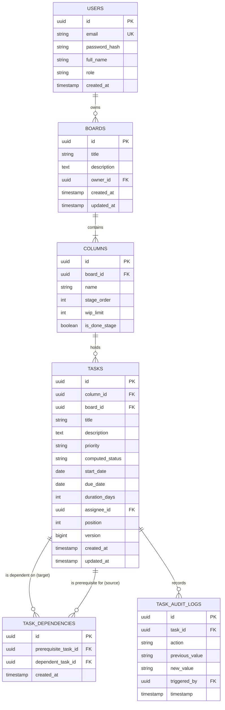

# TaskFlow Pro: Kanban Board Setup Guide & Combined Design Document

> **Deliverable Scope:**  
> This document fulfills both the **Setup Guide** and the mandatory **Architecture, Data Model, and Known Limitations Write-Up** (Combined Design Document) required for **TaskFlow Pro (PS-01: Dependency-Aware Workflow & DAG Scheduling Engine)**.

---

## Table of Contents
1. [Project Overview](#1-project-overview)
2. [Quickstart & Setup Instructions](#2-quickstart--setup-instructions)
   - [2.1 Prerequisites](#21-prerequisites)
   - [2.2 Repository Structure](#22-repository-structure)
   - [2.3 Environment Configuration](#23-environment-configuration)
   - [2.4 Database Setup & Migrations](#24-database-setup--migrations)
   - [2.5 Running the Backend (Spring Boot)](#25-running-the-backend-spring-boot)
   - [2.6 Running the Frontend (React + Vite)](#26-running-the-frontend-react--vite)
   - [2.7 Running via Docker Compose](#27-running-via-docker-compose)
   - [2.8 Seeded Sample Data (8–10 Tasks)](#28-seeded-sample-data-810-tasks)
3. [System Architecture](#3-system-architecture)
   - [3.1 High-Level Component Diagram](#31-high-level-component-diagram)
   - [3.2 Layered System Topology](#32-layered-system-topology)
   - [3.3 Real-Time State Synchronization](#33-real-time-state-synchronization)
4. [Data Model & Database Schema](#4-data-model--database-schema)
   - [4.1 Entity Relationship Diagram (ERD)](#41-entity-relationship-diagram-erd)
   - [4.2 Relational Schema Definitions](#42-relational-schema-definitions)
   - [4.3 Constraints & Indexing Strategy](#43-constraints--indexing-strategy)
5. [Core Engine Mechanics](#5-core-engine-mechanics)
   - [5.1 Kanban State Machine Transitions](#51-kanban-state-machine-transitions)
   - [5.2 DAG Dependency & Cycle Detection Engine](#52-dag-dependency--cycle-detection-engine)
   - [5.3 Diamond Dependency & Non-Compounding Propagation](#53-diamond-dependency--non-compounding-propagation)
   - [5.4 Regression Rollback Mechanism](#54-regression-rollback-mechanism)
   - [5.5 Critical Path Calculation](#55-critical-path-calculation)
6. [Known Limitations & Architectural Trade-offs](#6-known-limitations--architectural-trade-offs)
7. [Verification & Health Checks](#7-verification--health-checks)

---

## 1. Project Overview

**TaskFlow Pro** is an enterprise-grade workflow orchestration platform featuring a fast, responsive **Kanban Board** backed by an authoritative **Directed Acyclic Graph (DAG) scheduling engine**. 

Unlike conventional Kanban systems where task cards operate as independent silos, TaskFlow Pro enforces strict dependency constraints:
- Downstream tasks cannot start or advance to *Done* until all prerequisite parent tasks have completed.
- Dynamic **Blocked / Ready** state badges reflect real-time graph states.
- Circular dependencies (e.g., $A \rightarrow B \rightarrow C \rightarrow A$) are prevented on creation/update.
- Date shifts on parent tasks automatically propagate to dependents without compounding diamond errors.
- Regressing a task from *Done* to *In Progress* immediately rolls downstream dependents back to *Blocked*.

---

## 2. Quickstart & Setup Instructions

### 2.1 Prerequisites
Ensure your local development environment has the following installed:
* **Java Development Kit (JDK)**: Version 17 or 21+ (`java -version`)
* **Apache Maven**: Version 3.8+ (`mvn -v`)
* **Node.js**: Version 18.x or 20.x LTS (`node -v`)
* **npm**: Version 9.x+ (`npm -v`)
* **Docker & Docker Compose**: (Optional, for containerized run)
* **PostgreSQL**: Version 14+ (or SQLite / H2 for zero-config testing)

---

### 2.2 Repository Structure
```text
CS-Hackathon/
├── Hackthaon_BE/               # Java 17/21 Spring Boot 3 Backend
│   ├── src/main/java/          # Controllers, Services, DAG Engine, Repositories
│   ├── src/main/resources/     # application.yml, db/migration (Flyway SQL)
│   ├── pom.xml                 # Maven dependencies
│   └── docker-compose.yml      # Local DB & App orchestration
├── hackathon_Frontend/         # React + Vite Frontend (Candidate Portal)
│   ├── src/components/         # KanbanBoard, TaskCard, DependencyModal, etc.
│   ├── src/services/           # Axios HTTP client & WebSocket hooks
│   ├── package.json
│   └── vite.config.js
├── KANBAN_SETUP_AND_DESIGN.md  # This Combined Design & Setup Document
├── KANBAN_TEST_SUITE_AND_FAILURE_CASES.md # Test matrix & known failure modes
└── DUMMY_JAVA_FULLSTACK_RESUME.md         # Dummy candidate profile for testing
```

---

### 2.3 Environment Configuration

Create a `.env` file in `Hackthaon_BE/` and `hackathon_Frontend/`:

#### Backend Configuration (`Hackthaon_BE/.env` or `application-local.yml`):
```env
SERVER_PORT=8080
SPRING_PROFILES_ACTIVE=dev

# Database Configuration (PostgreSQL)
SPRING_DATASOURCE_URL=jdbc:postgresql://localhost:5432/taskflow_db
SPRING_DATASOURCE_USERNAME=taskflow_user
SPRING_DATASOURCE_PASSWORD=taskflow_pass
SPRING_JPA_HIBERNATE_DDL_AUTO=validate

# JWT Security
SECURITY_JWT_SECRET_KEY=9a4f2c8d7e1b5a3f6c8d2e4b7a1c9e3f5a7b2d4e6f8c1a3b5d7e9f2a4c6e8b1d
SECURITY_JWT_EXPIRATION_MS=86400000

# CORS
CORS_ALLOWED_ORIGINS=http://localhost:5173,http://localhost:3000
```

#### Frontend Configuration (`hackathon_Frontend/.env`):
```env
VITE_API_BASE_URL=http://localhost:8080/api
VITE_WS_BASE_URL=ws://localhost:8080/ws
```

---

### 2.4 Database Setup & Migrations

If using a local PostgreSQL instance:
```bash
# Connect to PostgreSQL and create database
psql -U postgres -c "CREATE USER taskflow_user WITH PASSWORD 'taskflow_pass';"
psql -U postgres -c "CREATE DATABASE taskflow_db OWNER taskflow_user;"
```
Flyway database migrations will automatically execute upon Spring Boot startup from `src/main/resources/db/migration/`.

---

### 2.5 Running the Backend (Spring Boot)

Navigate to the backend directory and run:
```bash
cd Hackthaon_BE

# Clean compile and build jar
./mvnw clean package -DskipTests

# Run the Spring Boot application
./mvnw spring-boot:run
```
The backend server will start on `http://localhost:8080`.
* **Swagger API Documentation:** `http://localhost:8080/swagger-ui.html`
* **Health Endpoint:** `http://localhost:8080/actuator/health`

---

### 2.6 Running the Frontend (React + Vite)

In a new terminal window:
```bash
cd hackathon_Frontend

# Install dependencies
npm install

# Start Vite development server
npm run dev
```
Open your browser and navigate to `http://localhost:5173`.

---

### 2.7 Running via Docker Compose

To launch the full stack (PostgreSQL + Spring Boot Backend + React Frontend) with a single command:
```bash
cd Hackthaon_BE
docker compose up -d --build
```
To stop the services:
```bash
docker compose down -v
```

---

### 2.8 Seeded Sample Data (8–10 Tasks)

The system automatically initializes 8 curated sample tasks upon first launch to demonstrate linear chains, diamond dependencies, independent tasks, and dynamic badge computations:

```
[TASK-01: Schema & DB Setup] (Done)
      |
      +---> [TASK-02: User Auth & JWT] (Done)
      |         |
      |         +---> [TASK-04: Task Engine API] (In Progress) <---+
      |                                                            |  (Diamond Shape)
      +---> [TASK-03: Cloud Infra & S3] (Done)                    |
                |                                                  |
                +---> [TASK-05: GraphQL & Cache Layer] (In Progress)+
                            |
                            v
                    [TASK-06: End-to-End Integration Suite] (Blocked)
                            |
                            v
                    [TASK-07: Production Deployment Pipeline] (Blocked)

[TASK-08: UI Design System] (Done) ---> [TASK-09: React Kanban Board] (In Progress)
[TASK-10: User Documentation & Tutorials] (Backlog - Independent Task)
```

| Task ID | Title | Column | Prerequisites | Computed Status | Dates |
| :--- | :--- | :--- | :--- | :--- | :--- |
| **TASK-01** | Database Schema & Migrations | Done | None | Completed | Day 1 - Day 2 |
| **TASK-02** | User Authentication & JWT | Done | TASK-01 | Completed | Day 2 - Day 4 |
| **TASK-03** | Cloud Infrastructure & S3 | Done | TASK-01 | Completed | Day 2 - Day 5 |
| **TASK-04** | Task Engine REST API | In Progress | TASK-02 | In Progress | Day 4 - Day 8 |
| **TASK-05** | GraphQL & Redis Cache Layer | In Progress | TASK-03 | In Progress | Day 5 - Day 9 |
| **TASK-06** | E2E Integration Test Suite | Backlog | TASK-04, TASK-05 | **Blocked** *(waiting for 04 & 05)* | Day 9 - Day 12 |
| **TASK-07** | Production Deployment | Backlog | TASK-06 | **Blocked** *(waiting for 06)* | Day 12 - Day 14 |
| **TASK-08** | UI Design System & Tokens | Done | None | Completed | Day 1 - Day 3 |
| **TASK-09** | React Kanban Board UI | In Progress | TASK-08 | In Progress | Day 3 - Day 7 |
| **TASK-10** | User Documentation & Guides | Backlog | None | **Ready** *(Independent)* | Day 7 - Day 10 |

---

## 3. System Architecture

### 3.1 High-Level Component Diagram

```
+-------------------------------------------------------------------------+
|                               FRONTEND                                  |
|   +-----------------------------------------------------------------+   |
|   |         React 18 + Vite (HTML5 Drag & Drop / Lucide Icons)       |   |
|   |   - KanbanBoard (Backlog, In Progress, Review, Done)            |   |
|   |   - TaskCard (Dynamic 'Blocked' / 'Ready' Badge UI)             |   |
|   |   - DependencyModal (Graph Inspector & Cycle Warning Toasts)     |   |
|   |   - CriticalPathTimeline (Visualizes unbroken critical chain)   |   |
|   +-----------------------------------------------------------------+   |
+------------------------------------+------------------------------------+
                                     |  REST API (JSON) / WebSocket
                                     v
+-------------------------------------------------------------------------+
|                                BACKEND                                  |
|   +-----------------------------------------------------------------+   |
|   |         Spring Boot 3 API Controllers (REST Endpoints)          |   |
|   +--------------------------------+--------------------------------+   |
|                                    |                                    |
|   +--------------------------------v--------------------------------+   |
|   |                        SERVICE LAYER                            |   |
|   |  - TaskService (State machine transitions & WIP limit guards)   |   |
|   |  - DAGValidationEngine (Cycle detector & Topological Sorter)    |   |
|   |  - SchedulePropagationService (Early/Late Date Cascader)        |   |
|   |  - CriticalPathService (Longest dependency path calculator)     |   |
|   +--------------------------------+--------------------------------+   |
|                                    |                                    |
|   +--------------------------------v--------------------------------+   |
|   |                DATA PERSISTENCE & TRANSACTION                   |   |
|   |  - Spring Data JPA Repositories                                 |   |
|   |  - @Version Optimistic Locking & @Transactional Integrity       |   |
|   +--------------------------------+--------------------------------+   |
+------------------------------------+------------------------------------+
                                     |  JDBC
                                     v
+-------------------------------------------------------------------------+
|                          DATABASE STORAGE                               |
|   +-----------------------------------------------------------------+   |
|   |  PostgreSQL 15+ (Relational Schema, Foreign Keys, Unique Bounded)|   |
|   +-----------------------------------------------------------------+   |
+-------------------------------------------------------------------------+
```

### 3.2 Layered System Topology
1. **Presentation Layer (React 18 / Tailwind / Zustand)**:
   - Renders Kanban columns with drag-and-drop mechanics.
   - Calculates visual feedback for drag operations (e.g., highlights invalid drops on blocked tasks).
   - Listens to WebSocket events for real-time collaborative updates across clients.
2. **API & Security Layer (Spring Web / Spring Security)**:
   - Enforces JWT-based bearer authentication and RBAC permissions.
   - Validates incoming payloads using Jakarta Bean Validation (`@Valid`, `@NotNull`, `@Size`).
3. **DAG & Workflow Engine (Core Domain Service)**:
   - Maintains an in-memory graph representation of board tasks.
   - Executes DFS reachability checks before persisting new dependency edges to guarantee cycle prevention.
   - Performs topological sorting via Kahn's algorithm to determine safe evaluation sequences.
4. **Schedule Propagation Engine**:
   - Computes task start and finish dates by propagating early start (ES) constraints forward.
   - Accurately resolves diamond dependencies so multi-parent paths use $\max(\text{Prerequisites})$ rather than additive compounding.
5. **Persistence Layer (Hibernate / JPA / PostgreSQL)**:
   - Enforces referential integrity through foreign key constraints with indexed lookup columns.
   - Employs JPA `@Version` columns on the `tasks` entity to prevent lost updates during concurrent edits.

### 3.3 Real-Time State Synchronization
When a user moves a card or modifies a dependency:
1. The client dispatches a `PATCH /api/tasks/{id}/move` request.
2. The server executes state transitions, checks WIP limits, and evaluates downstream DAG impacts within an ACID transaction.
3. Upon commit, the server publishes a STOMP event over `/topic/board/{boardId}/events`.
4. All connected subscriber clients receive the payload and update their local state without triggering full page reloads.

---

## 4. Data Model & Database Schema

### 4.1 Entity Relationship Diagram (ERD)



### 4.2 Relational Schema Definitions

#### `tasks` Table
```sql
CREATE TABLE tasks (
    id UUID PRIMARY KEY DEFAULT gen_random_uuid(),
    board_id UUID NOT NULL REFERENCES boards(id) ON DELETE CASCADE,
    column_id UUID NOT NULL REFERENCES columns(id) ON DELETE RESTRICT,
    title VARCHAR(255) NOT NULL,
    description TEXT,
    priority VARCHAR(32) NOT NULL DEFAULT 'MEDIUM',
    computed_status VARCHAR(32) NOT NULL DEFAULT 'READY',
    start_date DATE NOT NULL,
    due_date DATE NOT NULL,
    duration_days INT NOT NULL DEFAULT 1,
    assignee_id UUID REFERENCES users(id) ON DELETE SET NULL,
    position INT NOT NULL DEFAULT 0,
    version BIGINT NOT NULL DEFAULT 0,
    created_at TIMESTAMP WITH TIME ZONE DEFAULT CURRENT_TIMESTAMP,
    updated_at TIMESTAMP WITH TIME ZONE DEFAULT CURRENT_TIMESTAMP,
    CONSTRAINT chk_dates CHECK (due_date >= start_date)
);
```

#### `task_dependencies` Table
```sql
CREATE TABLE task_dependencies (
    id UUID PRIMARY KEY DEFAULT gen_random_uuid(),
    prerequisite_task_id UUID NOT NULL REFERENCES tasks(id) ON DELETE CASCADE,
    dependent_task_id UUID NOT NULL REFERENCES tasks(id) ON DELETE CASCADE,
    created_at TIMESTAMP WITH TIME ZONE DEFAULT CURRENT_TIMESTAMP,
    CONSTRAINT uk_prerequisite_dependent UNIQUE (prerequisite_task_id, dependent_task_id),
    CONSTRAINT chk_no_self_dependency CHECK (prerequisite_task_id <> dependent_task_id)
);
```

### 4.3 Constraints & Indexing Strategy
* **Unique Pair Constraint**: `UNIQUE(prerequisite_task_id, dependent_task_id)` prevents redundant edge creation.
* **No Self-Dependency Check**: `CHECK(prerequisite_task_id <> dependent_task_id)` enforces $A \not\rightarrow A$ directly at the database engine level.
* **Foreign Key Indices**:
  * `CREATE INDEX idx_deps_prereq ON task_dependencies(prerequisite_task_id);`
  * `CREATE INDEX idx_deps_dep ON task_dependencies(dependent_task_id);`
  * `CREATE INDEX idx_tasks_board_column ON tasks(board_id, column_id);`
  These indices ensure $O(1)$ edge queries and prevent $N+1$ table scans during recursive graph traversals.

---

## 5. Core Engine Mechanics

### 5.1 Kanban State Machine Transitions
A task transitions through 4 primary Kanban columns:
1. **Backlog (To Do)**: Newly created tasks.
2. **In Progress**: Active execution. Can only be entered if `computed_status == READY`.
3. **Review**: Completed work undergoing peer inspection or QA.
4. **Done**: Terminal success stage.

```
       +--------------+          +-----------------+
       |   Backlog    | -------> |   In Progress   |
       +--------------+          +-----------------+
              ^                           |
              | (Rollback on              v
              |  Prereq Reversion) +--------------+
              +------------------- |    Review     |
                                   +--------------+
                                          |
                                          v
                                   +--------------+
                                   |     Done     |
                                   +--------------+
```

* **Guard Condition**: If a task has unfinished prerequisites, any attempt to move it to *In Progress*, *Review*, or *Done* is rejected by the backend with HTTP `422 Unprocessable Entity` (`"Task is BLOCKED by pending prerequisites"`).

---

### 5.2 DAG Dependency & Cycle Detection Engine
Prior to inserting an edge $(U \rightarrow V)$ (where $U$ is prerequisite, $V$ is dependent):
1. **Check Self-Loop**: Verify $U \neq V$.
2. **Check Direct Inversion**: Verify edge $(V \rightarrow U)$ does not already exist.
3. **Reachability Check (Depth-First Search / BFS)**:
   - Check if path $V \rightsquigarrow U$ exists in the active graph.
   - If a path exists, adding $(U \rightarrow V)$ would create a directed cycle $U \rightarrow V \rightsquigarrow U$.
   - The transaction immediately aborts and throws `CircularDependencyException` with the explicit cycle chain:
     ```
     Error 400 Bad Request: Circular dependency detected: [TASK-03 -> TASK-05 -> TASK-07 -> TASK-03]
     ```

#### Cycle Detection Algorithm (Java Snippet):
```java
public void validateNoCycle(UUID prereqId, UUID dependentId) {
    if (prereqId.equals(dependentId)) {
        throw new CircularDependencyException("Self-dependency is not allowed");
    }
    Set<UUID> visited = new HashSet<>();
    if (isReachable(dependentId, prereqId, visited)) {
        throw new CircularDependencyException(
            String.format("Circular dependency detected between %s and %s", prereqId, dependentId));
    }
}

private boolean isReachable(UUID current, UUID target, Set<UUID> visited) {
    if (current.equals(target)) return true;
    visited.add(current);
    List<UUID> nextDependents = dependencyRepository.findDependentIdsByPrerequisiteId(current);
    for (UUID next : nextDependents) {
        if (!visited.contains(next) && isReachable(next, target, visited)) {
            return true;
        }
    }
    return false;
}
```

---

### 5.3 Diamond Dependency & Non-Compounding Propagation
In a classic diamond dependency structure:
```
       +--- [TASK-B: 3 days] ---+
       |                        |
[TASK-A: 2 days]                +---> [TASK-D: 2 days]
       |                        |
       +--- [TASK-C: 4 days] ---+
```
* If $TASK-A$ is delayed by 3 days:
  * Both $TASK-B$ and $TASK-C$ shift forward by 3 days.
  * $TASK-D$ depends on both $B$ and $C$.
  * **Rule of Non-Compounding**: $TASK-D$'s earliest start date is:
    $$\text{EarliestStart}(D) = \max(\text{DueDate}(B), \text{DueDate}(C))$$
  * It shifts forward by exactly **3 days** (the maximum shift of its parents), **NOT 6 days** ($3 + 3$).

---

### 5.4 Regression Rollback Mechanism
If a task in the *Done* column (e.g., $TASK-A$) is dragged back to *In Progress* or *Backlog*:
1. The status of $TASK-A$ becomes `IN_PROGRESS`.
2. All downstream tasks that directly or transitively depend on $TASK-A$ have their computed state recalculated.
3. Because $TASK-A$ is no longer *Done*, all downstream tasks become **`BLOCKED`**.
4. If any downstream task was currently marked *Ready*, its badge changes to *Blocked*, and movement to *Done* is prohibited.

---

### 5.5 Critical Path Calculation
The Critical Path is the sequence of dependent tasks that determines the minimum total project duration.
* For each task $i$, compute:
  * $\text{Early Start (ES)}_i = \max_{p \in \text{Prereq}(i)} (\text{Early Finish}_p)$
  * $\text{Early Finish (EF)}_i = \text{ES}_i + \text{Duration}_i$
  * $\text{Late Finish (LF)}_i = \min_{s \in \text{Dependents}(i)} (\text{Late Start}_s)$
  * $\text{Late Start (LS)}_i = \text{LF}_i - \text{Duration}_i$
  * $\text{Slack}_i = \text{LS}_i - \text{ES}_i$
* Tasks where $\text{Slack} = 0$ constitute the **Critical Path**. Any delay on these tasks directly postpones the project completion date.

---

## 6. Known Limitations & Architectural Trade-offs

1. **Cross-Board Dependency Boundaries**:
   - *Limitation*: Dependencies can currently only be established between tasks on the same Board.
   - *Rationale*: Prevents multi-board deadlock scenarios and maintains clean organizational boundaries for permissions and transactional consistency.
2. **Deep Graph Traversal Limits**:
   - *Limitation*: Traversal depth is capped at 100 hops (`MAX_GRAPH_DEPTH = 100`).
   - *Mitigation*: Graphs deeper than 100 tiers throw a validation error to prevent call-stack overflows and runaway memory consumption in pathological topologies.
3. **High-Contention Bulk Modifications**:
   - *Limitation*: If two project managers concurrently modify dependencies across the same diamond graph, one transaction will receive an `OptimisticLockException`.
   - *Mitigation*: The client UI detects HTTP 409 Conflict, displays an inline retry notification, and fetches the latest board state.
4. **Soft Deletion of Tasks**:
   - *Limitation*: Tasks marked deleted retain historical dependency records in the audit log, but active graph traversal filters out soft-deleted nodes (`is_deleted = false`).

---

## 7. Verification & Health Checks

Verify your setup by executing the following commands:

```bash
# 1. Check Backend Health
curl -s http://localhost:8080/actuator/health
# Expected: {"status":"UP"}

# 2. Query Seeded Tasks
curl -s http://localhost:8080/api/boards | jq .

# 3. Test Cycle Detection Endpoint
curl -X POST http://localhost:8080/api/tasks/dependencies \
  -H "Content-Type: application/json" \
  -d '{"prerequisiteTaskId":"<TASK_B_UUID>", "dependentTaskId":"<TASK_A_UUID>"}'
# Expected HTTP 400 Bad Request: "Circular dependency detected"
```
